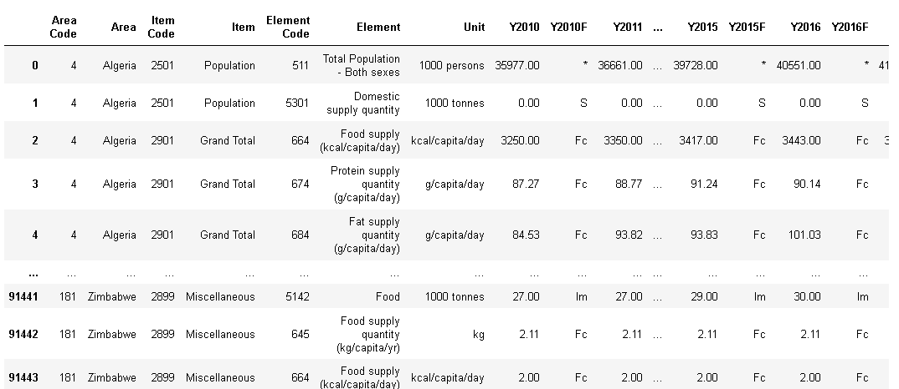

# Quick guide on cleaning a dataset using pandas
This is a repo to give a quick start in cleaning raw dataset.

## Table of content
- The good world of data
- The Art of data cleaning
- Resources
- Conclusion

## The good world of data
It's evident all around us that data is now driving every single decision we make as individuals or corporate bodies. With every activity performed, we are dishing out tones of data either structured or unstructured. When this data is collected, insight can be generated however our insight won't be clear if the data is not cleaned. When using data, most people agree that your insights and analysis are only as good as the data you are using.


## The Art of data cleaning
There are currently many approaches for cleaning a dataset and it depends on the type of dataset. A general approach to data cleaning will be to:
- Remove any duplicate
- Fix structural errors
- Filter unwanted outliers
- Handle missing data
- Validate and QA

For this guide, we will be working on handling missing data in our dataset using Jupyter Notebook. The full Jupyter notebook script can be downloaded from the GitHub repo [here](https://github.com/RoyalVee/Quick-data-cleaning-guide-with-pandas.git)


## Step 1 : Import the needed packages
The first step is to import the packages needed for the cleaning operation.

```
import pandas as pd
import pickle as pk
import matplotlib.pyplot as plt
from PIL import Image
from IPython.display import display
```

## Step 2 : Read the Raw file into your script
Load the file to be cleaned into the notebook.
For this guide, we will be using a food balance dataset. You can try it out with another dataset.

The dataset used for this guide can be downloaded from my GitHub repository [here](https://github.com/RoyalVee/Quick-data-cleaning-guide-with-pandas/blob/master/Food%20balance%20data.csv)

```
data  = pd.read_csv("Food Balance data.csv")
```
view the loaded data.

```
data
```
Output:


load the data into a dataframe
```
df = pd.DataFrame(data)
```

## Step 3 : Dectect missing values
Detect missing values and count missing values by columns.

- check the data type of each column in your dataset which will guide on how each column is cleaned.
```
df.dtypes
````

```
Output:
Area Code         int64
Area             object
Item Code         int64
Item             object
Element Code      int64
Element          object
Unit             object
Y2010           float64
Y2010F           object
Y2011           float64
Y2011F           object
Y2012           float64
Y2012F           object
Y2013           float64
Y2013F           object
Y2014           float64
Y2014F           object
Y2015           float64
Y2015F           object
Y2016           float64
Y2016F           object
Y2017           float64
Y2017F           object
Y2018           float64
Y2018F           object
Y2019           float64
Y2019F           object
dtype: object
```

- Check for NaN and Detect missing values in the dataset. Count the number of missing values in the dataset by columns.
```
df.isnull().sum()
```

```
Output:
Area Code           0
Area                0
Item Code           0
Item                0
Element Code        0
Element             0
Unit                0
Y2010           29045
Y2010F          25379
Y2011           29031
Y2011F          25367
Y2012           27723
Y2012F          23998
Y2013           27927
Y2013F          26741
Y2014           27646
Y2014F          25893
Y2015           27562
Y2015F          25799
Y2016           27646
Y2016F          25911
Y2017           27451
Y2017F          26582
Y2018           27302
Y2018F          27086
Y2019           27374
Y2019F          27366
dtype: int64
```

## Step 4 : Drop or Fill missing values
At this point, based on your understanding of what you intend to use the dataset to achieve, you can proceed to either drop or fill the missing values in the dataset.

### For this guide, we will do the following:

- Drop all rows with any missing value, load the result to a new data frame (cleaned_data1) and serialize the data.
- Drop all rows with all its columns having missing values and load the result to a new data frame (cleaned_data2).
- Drop all rows with its columns from Y2010 to Y2019 having missing values (cleaned_data3).

### Drop all rows with any missing values
- Get a copy of the data so we can perform the other operations from the main data frame.
```
df_temp = df.copy()
```
- Drop all rows with any missing values and load the result to a new data frame (cleaned_data1).
```
cleaned_data1 = df_temp.dropna(axis = "index", how = "any")
```
- check to confirm no missing values in the dataset.
```
cleaned_data1.isnull().sum()
```
````
Output:
Area Code       0
Area            0
Item Code       0
Item            0
Element Code    0
Element         0
Unit            0
Y2010           0
Y2010F          0
Y2011           0
Y2011F          0
Y2012           0
Y2012F          0
Y2013           0
Y2013F          0
Y2014           0
Y2014F          0
Y2015           0
Y2015F          0
Y2016           0
Y2016F          0
Y2017           0
Y2017F          0
Y2018           0
Y2018F          0
Y2019           0
Y2019F          0
dtype: int64
````

- pickle the cleaned data to serialize it into a file.
````
with open("clean data 1.pkl", "wb") as file:
    pk.dump(cleaned_data1, file)
````

### Drop all rows with all its columns having missing values and load the result to a new data frame (cleaned_data2) 

````
cleaned_data2 = df_temp.dropna(axis = "index", how = "all")
````

### Drop all rows with its columns from Y2010 to Y2019 having missing values (cleaned_data3)

````
cleaned_data3 = df_temp.dropna(subset = list(df_temp.columns[7:]))
````

## Quick Visuals on the cleaned data
Now you were able to clean the missing values from your dataset. You can proceed to visualize the data and perform further data operations on your dataset.

Let's create some quick visuals from our cleaned data 1 dataset.

- load the serialized cleaned data 1
````
with open("clean data 1.pkl", "rb") as file:
    data_main = pk.load(file)
````

- Visual for the top 5 countries in total sum for each year column

````
groupdata  = data_main.groupby(["Area"]).sum()  

data_plt = groupdata[groupdata.columns[3:]]

years = data_plt.columns

for year in years:
    top5 = data_plt.sort_values(by = [year], ascending = False)[year].head(5)
    plt.bar(top5.index, top5.values)
    plt.ylabel("Total Supply for " + year)
    plt.xlabel("Top 5 countries")
    fig = plt.gcf()
    fig.set_size_inches(15.5,8.5)
    fig.savefig(year+".png")
````


- View the saved graph 
```
for i in years:
    display(Image.open(i+".png"))
````

Output for Y2010:


## Resources

- [Pandas API Reference](https://pandas.pydata.org/docs/reference/index.html)

## Conclusion 

Trust you found this article informative regarding the steps you can take in cleaning missing values from your dataset. You can also check out my blog for other guides in handling outliers, duplicate, and other data cleaning operations. 

I'd love to connect with you at [Twitter](https://twitter.com/VictorOguche6) | [LinkedIn](https://www.linkedin.com/in/victoroguche/) | [GitHub](https://github.com/RoyalVee)

