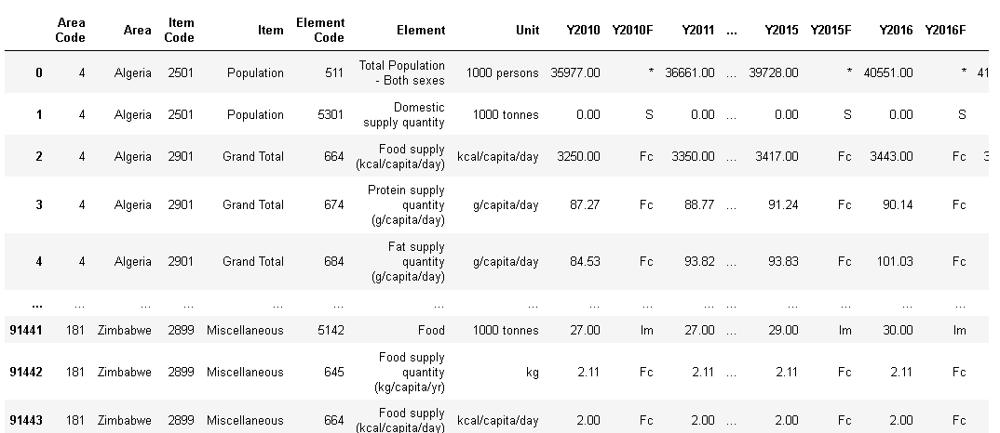

# Quick guide on cleaning a dataset using pandas

## Table of content
- The good world of data
- 

# Introduction
Data is said to be true

## The good world of data
It's evident all around us that data is now driving every single decision we make as indiviuals or corporate bodies. With every activity performed we are dishing tones of data either structured or unstructured. However means the data is given, one common factor is that insight can be generated from any collected data but our insight won't be clear if the data is not cleaned and well prepared to provide the insight we want.When using data, most people agree that your insights and analysis are only as good as the data you are using.

## The Art of data cleaning
There are currently may apporach for cleaning a dataset and it depends on the type of dataset. A general apporach to data cleaning will be to:
- Remove any duplicate
- Fix structural errors
- Filter unwanted outliers
- Handle missing data
- Validate and QA

For this guide we will be working on handling missing data in our dataset using Jupyter Notebook. The full Jupyter notebook script can be downloaded from the github repo [here](https://github.com/RoyalVee/Quick-data-cleaning-guide-with-pandas.git)


## Step 1 : Import the needed packages
The first step is to import the packages needed for the cleaning operation.

```
import pandas as pd
import pickle as pk
import matplotlib.pyplot as plt
from PIL import Image
from IPython.display import display
```

## Step 2 : Read the Raw file into your script
Load all the files you need to clean into you notebook.
for this guide we will be using a food balance dataset. You can try out with another dataset.

The dataset used for this guide can be downloaded from my github repository [here](https://github.com/RoyalVee/Quick-data-cleaning-guide-with-pandas.git)

```
data  = pd.read_csv("Food Balance data.csv")
```
view the loaded data.

```
data
```
Output:

